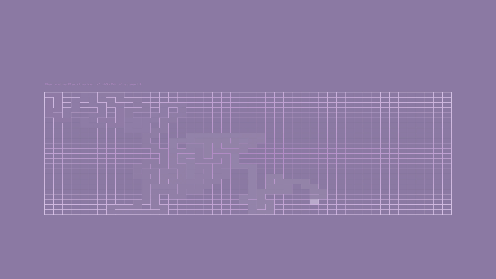

<!-- Codex workflow test -->

# mazeASK

Maze generation algorithms

---

## Live

Open the fullscreen sketch:

https://editor.p5js.org/asymptoticSystemKey/full/FJk1OWjNb

Best viewed on desktop in Chrome.

---

## What this is

An interactive p5.js lab for exploring maze generation algorithms through their behavior and output.

Switch between algorithms and watch how each one builds structure in real time.

Same grid. Same constraints. Different rules.

---

## Architecture

`mazeASK.js` is structured as a single p5.js sketch with three phases: initialization, incremental generation, and rendering. The `step...ASK()` functions contain the algorithm-specific generation logic.

---

## Algorithms

- Recursive Backtracker  
- Binary Tree  
- Prim  
- Sidewinder  
- Eller  
- Kruskal  
- Wilson  
- Aldous–Broder  

See [mazeASK-algorithm-notes.md](mazeASK-algorithm-notes.md) for a breakdown of each algorithm and what it produces.

---

## Key idea

All of these are doing the same thing >>

building a spanning tree.

What changes is how the next connection is chosen.

That choice introduces bias.  
That bias shapes the structure.  
That structure is what you see.

---

## Controls

### Algorithms
- `1` Recursive Backtracker  
- `2` Binary Tree  
- `3` Prim  
- `4` Sidewinder  
- `5` Eller  
- `6` Kruskal  
- `7` Wilson  
- `8` Aldous–Broder  

### Interaction
- `space` regenerate  
- `r` recolor  
- `h` toggle rectangular / hex topology  
- `t` toggle rectangular / triangle topology  
- `-` / `+` adjust speed  
- drag horizontally to change speed  

### Density
- `[` decrease grid  
- `]` increase grid  

### Output
- `o` toggle output mode  
- `p` toggle square / widescreen  

---

## Topology mode

Rectangular is the default baseline.

Hex is opt-in through the `H` toggle.

Hex currently works for:
- Recursive Backtracker
- Binary Tree
- Prim
- Aldous–Broder
- Wilson
- Kruskal

Triangle is opt-in through the `T` toggle.

Triangle currently works for:
- Recursive Backtracker
- Binary Tree
- Prim
- Aldous–Broder
- Wilson
- Kruskal

Sidewinder and Eller remain rectangular-only for now.

---

## Run locally (source)

1. Rename:

    mazeASK.js → sketch.js

2. Place inside a p5.js project

3. Run:

    npx serve

4. Open the local URL shown in your terminal

---

## License

Apache 2.0
